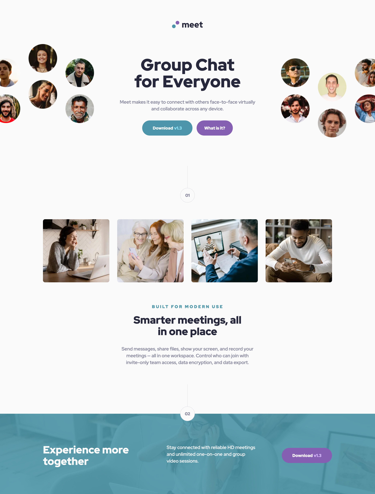
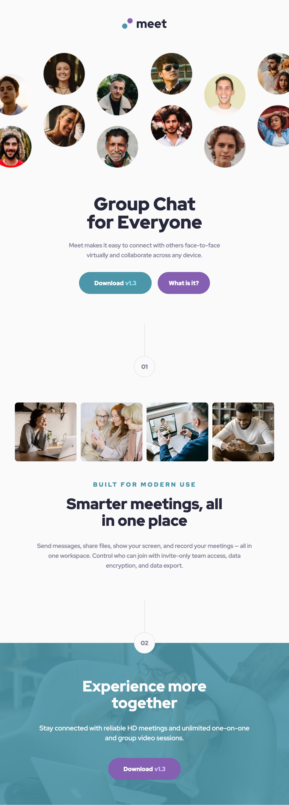
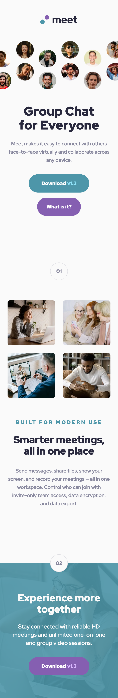

# Frontend Mentor - Meet landing page solution

This is a solution to the [Meet landing page challenge on Frontend Mentor](https://www.frontendmentor.io/challenges/meet-landing-page-rbTDS6OUR). Frontend Mentor challenges help you improve your coding skills by building realistic projects.

## Table of contents

- [Overview](#overview)
  - [The challenge](#the-challenge)
  - [Screenshot](#screenshot)
  - [Links](#links)
- [Getting Started](#getting-started)
  - [Prerequisites](#prerequisites)
  - [Installation](#installation)
- [My process](#my-process)
  - [Built with](#built-with)
  - [What I learned](#what-i-learned)
  - [Continued development](#continued-development)
  - [Useful resources](#useful-resources)
- [Author](#author)

## Overview

### The challenge

Users should be able to:

- View the optimal layout depending on their device's screen size
- See hover states for interactive elements

### Screenshot

<div style='display: flex; gap: 10px;'>



</div>

### Links

- Solution URL: https://www.frontendmentor.io/solutions/meet-landing-page-with-nextjs-tailwind-css-laRUnuizFQ
- Live Site URL: https://meet-landing-page-sandy.vercel.app

## Getting Started

To get a local copy up and running follow these simple steps:

### Prerequisites

Make sure you have the following software installed on your machine:

- [Node.js](https://nodejs.org/) (Node.js 18.17 or later)
- [pnpm](https://pnpm.io/)

### Installation

1. Clone the repository:

   ```sh
   git clone https://github.com/jaceleedev/meet-landing-page.git
   ```

2. Navigate to the project directory:

   ```sh
   cd meet-landing-page
   ```

3. Install dependencies using pnpm:

   ```sh
   pnpm install
   ```

4. Start the development server:

   ```sh
   pnpm dev
   ```

5. Open your browser and visit http://localhost:3000 to view the project.

## My process

### Built with

- Next.js (v14.2.5)
- TypeScript (v5)
- Tailwind CSS (v3.4.1)
- Semantic HTML5 markup
- CSS Grid, Flexbox
- SEO & web accessibility

### What I learned

Throughout this project, I gained valuable insights and improved my skills in several areas:

I feel that I started off on the wrong foot with this project. I should have taken a mobile-first approach, but instead, I went with a desktop-first approach, which was regrettable. However, I'm really proud that I didn't give up or restart the project; I saw it through to the end. Despite making things more complicated than necessary, I gained a lot from the experience. Next time, I'll spend more time carefully analyzing the design and planning how to implement it more thoughtfully.

These learnings have not only improved my technical skills but also given me a clearer direction for future growth and areas to focus on in upcoming projects.

### Continued development

In future projects, I want to continue focusing on and improving in these areas:

1. Before starting the project, I plan to carefully choose between a desktop-first and a mobile-first approach. The decision will be based on the similarity of the design across different platforms.

2. As the number of components and sections increased, I found it increasingly difficult to manage the UI even without handling state. While it's not an immediate issue, I realize the importance of testing in frontend development. I need to learn how to effectively implement testing.

By focusing on these areas, I hope to continually improve my front-end development skills and create more efficient and sophisticated web applications.

### Useful resources

- [Next.js Documentation](https://nextjs.org/docs) - Comprehensive guide to Next.js features and API.
- [Tailwind CSS Documentation](https://tailwindcss.com/docs/installation) - Detailed documentation for Tailwind CSS.

## Author

- GitHub - [@jaceleedev](https://github.com/jaceleedev)
- Frontend Mentor - [@jaceleedev](https://www.frontendmentor.io/profile/jaceleedev)
